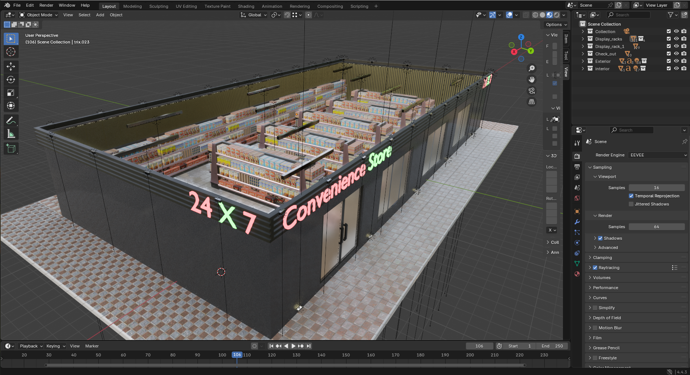
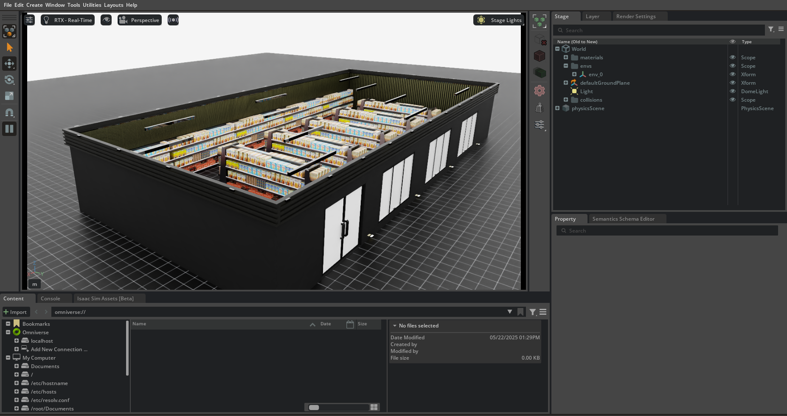

# Isaac-Importer

This tool allows you to import environments that have been built using Blender into IsaacSim. Using Blender allows you to easily diversify your environment portfolio by either leveraging the rich world of scenes that exist online or by offering a more accessible environment creation process compared to native IsaacSim. The designer no longer needs any knowledge of IsaacSim in order to build an environment. It has been specifically designed to be user friendly and was made for IsaacLab `v2.0`.

## Known Bugs:

- ❌ Text that has been added in Blender will not show up in IsaacSim.
- ❌ Lightsources are currently not supported.
- ❌ Glass is not transparent.


### Blender (Source)


### IsaacSim (Target)



## Exporting from Blender 

To export from blender, you can try the following settings: [Blender Export Settings](docs/blender_export_settings.md)

These settings work with Blender Version `4.4.3`.


## IsaacLab
The Blender Asset Importer is built for IsaacLab. As of right now, it cannot be used in plain IsaacSim. If you require the importer to also work with pure IsaacSim, feel free to contact us.

> Isaac Lab is a GPU-accelerated, open-source framework designed to unify and simplify robotics research workflows, such as reinforcement learning, imitation learning, and motion planning. Built on NVIDIA Isaac Sim, it combines fast and accurate physics and sensor simulation, making it an ideal choice for sim-to-real transfer in robotics. [[IsaacLab Github page](https://github.com/isaac-sim/IsaacLab)]

<!-- It is not natively part of IsaacSim and has to be downloaded and installed from the [IsaacLab Github](https://github.com/isaac-sim/IsaacLab) or via pip. We did the latter and followed the [IsaacLab pip installation guide](https://isaac-sim.github.io/IsaacLab/main/source/setup/installation/isaaclab_pip_installation.html), which will install IsaacLab and IsaacSim into your pip environment.  -->
<!-- This seems to be the preferred way going forward, as the old way of relying on the provided python environment that ships with IsaacSim seems to be deprecated.  -->

<!-- With IsaacLab, environment creation has moved away from manually spawning assets and applying their APIs and attributes, to writing configurations. These configurations define the types of APIs we want to apply to an asset or robot together with the appropriate values. The simulation then spawns the assets and applies all the neccesary APIs during scene creation. The [IsaacLab Documentation](https://isaac-sim.github.io/IsaacLab/main/index.html) goes into more detail.  -->


# Using the Importer

The importer generally consists of two files: `blender_asset_cfg.py` and `blender_asset.py`. The former holds the configuration template, which defines what information is required to spawn a given asset, as well as some helper functions to help us create the appropriate configurations. The latter holds the logic for asset creation itself. It is being called during scene creation and spawns a given asset into the scene and applies the neccesary APIs according to the specification defined in the `BlenderAssetCfg`. The `Blender_env_cfg.py` can be used as a template to start your research.

The following snippet is an excerpt from from the template. Examples on how to write a configuration, can be found [here](envs/supermarket.py). The full template can be found [here](blender_env_cfg.py).

## Snippet

```
...
from envs.my_new_env import MY_NEW_ENV

@configclass
class BlenderSceneCfg(InteractiveSceneCfg):
    # ground plane
    ground = AssetBaseCfg(
        prim_path="/World/defaultGroundPlane", spawn=sim_utils.GroundPlaneCfg()
    )

    # lights
    dome_light = AssetBaseCfg(
        prim_path="/World/Light",
        spawn=sim_utils.DomeLightCfg(intensity=3000.0, color=(0.75, 0.75, 0.75)),
    )

    assets = MANIBOT_AISLE

##
# Simulation Loop
##
def run_simulator(sim: SimulationContext, scene: InteractiveScene):
    """Runs the simulation loop."""
    # Extract scene entities
    assets: RigidObjectCollection = scene["assets"]
    # robot: Articulation = scene["robot"]

    # Define simulation stepping
    sim_dt = sim.get_physics_dt()
    count = 0

    scene.reset()
    print("[INFO]: Resetting scene state...")

    # Simulation loop
    while simulation_app.is_running():

        # DO STUFF

        # Write data to sim
        scene.write_data_to_sim()
        # Perform step
        sim.step()
        # Increment counter
        count += 1
        # Update buffers
        scene.update(sim_dt)


def main():
    """Main function."""
    # Load kit helper
    sim_cfg = sim_utils.SimulationCfg(dt=0.005, device=args_cli.device)
    sim = sim_utils.SimulationContext(sim_cfg)
    # Set main camera
    sim.set_camera_view([5.5, 8.0, 6.0], [5.5, -5.0, 0.0])  # eye and target positions

    # Design scene
    scene_cfg = BlenderSceneCfg(
        num_envs=args_cli.num_envs,
        env_spacing=args_cli.env_spacing,
        replicate_physics=False,
    )
    with Timer("[INFO] Time to create scene: "):
        scene = InteractiveScene(scene_cfg)

    # Play the simulator
    with Timer("[INFO] Time to reset the sim: "):
        sim.reset()
    # Now we are ready!
    print("[INFO]: Setup complete...")
    # Run the simulator
    run_simulator(sim, scene)


if __name__ == "__main__":
    # run the main execution
    main()
    # close sim app
    simulation_app.close()
```


## Debugging

For tips on debugging, kindly refer to [IsaacSim Debugging Notes](docs/debugging_isaac.md) and the official IsaacSim/IsaacLab documentation.
